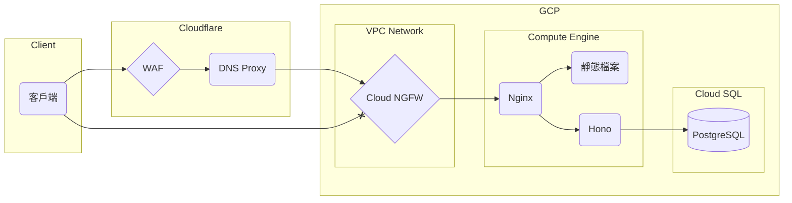

# 捐款查詢系統

## 初始化

### 環境變數

```dosini
DATABASE_URL=<string>
JWT_SECRET=<string>
```

### 安裝依賴

```bash
pnpm i -P
cd backend/database && pnpm run db:generate
```

## 系統架構



網站架設於 Google Cloud Platform 上，使用 Compute Engine 虛擬機運行。<br />
後端使用 Hono 框架，提供 API 與 API 文檔頁面。<br />
前端使用 Vue 框架，提供 SPA 應用。

Hono app 使用 pm2 管理確保持續運行，授權 token 格式為 JWT，有效期限 10 分鐘。每次 API 操作都會重新簽發。<br />
外部連線由 Nginx 提供服務，並使用 Let's Encrypt 自動化 SSL 憑證加密。<br />
Nginx 會將路徑 `/api`、`/docs`、`/openapi` 的請求導向 Hono app，其餘路徑提供 SPA 頁面服務。<br />
[Nginx 設定參閱此連結](https://github.com/xzihnago/debian-quick-setup/blob/main/nginx/conf.d/example.conf)

客戶端與伺服端之間的連線由 Cloudflare DNS Proxy 保護<br />
原點防火牆規則僅允許來自 Cloudflare 的連線。<br />
限速規則為 50r/10s，超出將封鎖 10s。<br />
[Cloudflare WAF 規則參閱此連結](https://github.com/xzihnago/debian-quick-setup/blob/main/cloudflare/waf.txt)

## 文件

- [API 文件](https://budda.paffuto-rich.com/docs)
- [頁面說明文件](docs/README.md)
- ~~[舊版含 API 完整說明](docs/README_old.md)~~
