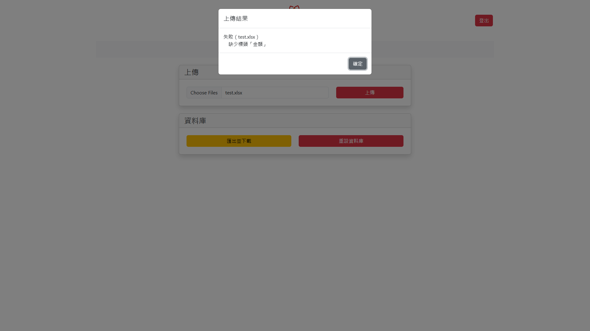

# 說明書

本系統為簡易的資料庫查詢系統，用於統計捐款資料。<br />
包含四個頁面，分別為登入、查詢、編輯關聯與上傳資料。<br />
有簡易 RWD 功能，可在不同裝置上正常顯示。

授權 token 的格式為 JWT，有效期限為 10 分鐘。每次操作都會重新簽發 token。

## API 說明

所有 API 皆使用 json 格式傳遞資料。<br />
所有 API 皆使用 `/api` 作為前綴。

所有 API 成功時，皆會回傳以下格式：

```ts
{
  data: any,
}
```

所有 API 失敗時，皆會回傳以下格式：

```ts
{
  error: any,
}
```

已處理之錯誤將會回傳指定的 `HTTP 4xx` 狀態碼。<br />
請求資料格式不正確時，將會回傳 `HTTP 422`。<br />
發生未處理錯誤時，將會回傳 `HTTP 500`。

<details>
<summary>/user</summary>

### POST `/user/login`

#### Request

本 API 無需授權。

```ts
{
  username: string,
  password: string,
}
```

#### Response

設定 cookie 中的 `token` 欄位，並導向 `/search` 頁面。<br />
失敗時將回傳 `HTTP 401`。

---

### GET `/user/logout`

#### Request

本 API 無需授權。

#### Response

清除 cookie 中的 `token` 欄位，並導向 `/` 頁面。

</details>

---

<details>
<summary>/donor</summary>

### DELETE `/donor`

刪除所有捐款紀錄。<br />
刪除資料庫中所有未加入關聯之捐款者資料。<br />
保留已加入關聯之捐款者資料。

#### Request

本 API 需要授權，若授權無效將回傳 `HTTP 401`。

#### Response

```ts
{
  data: {
    donors: number,
    records: number,
  }
}
```

欄位 `donors` 為刪除的捐款者數量。<br />
欄位 `records` 為刪除的捐款紀錄數量。

</details>

---

<details>
<summary>/donor-record</summary>

### GET `/donor-record/sum/:name`

#### Request

本 API 需要授權，若授權無效將回傳 `HTTP 401`。

#### Response

```ts
{
  data: number,
}
```

若資料庫中無此捐款者，將回傳 `HTTP 404`。

---

### POST `/donor-record`

#### Request

本 API 需要授權，若授權無效將回傳 `HTTP 401`。

```ts
[string, number][]
```

#### Response

```ts
{
  data: number,
}
```

欄位 `data` 為上傳的捐款紀錄數量。

---

### GET `/donor-record`

#### Request

本 API 需要授權，若授權無效將回傳 `HTTP 401`。

#### Response

```ts
{
  data: [string, number][],
}
```

欄位 `data` 為所有捐款者的捐款紀錄統計，格式為 `[姓名, 金額]`。

</details>

---

<details>
<summary>/donor-relations</summary>

### GET `/donor-relations/:name`

#### Request

本 API 需要授權，若授權無效將回傳 `HTTP 401`。

#### Response

```ts
{
  data: [string | null, string][],
}
```

欄位 `data` 為捐款者的關聯，格式為 `[上級, 下級]`，若無上級則為 `[null, 下級]`。<br />
若資料庫中無此捐款者，將回傳 `HTTP 404`。

---

### PUT `/donor-relations/:name`

#### Request

本 API 需要授權，若授權無效將回傳 `HTTP 401`。

```ts
{
  superior: string | null,
}
```

#### Response

若資料庫中無此捐款者，將回傳 `HTTP 404`。

</details>

## 頁面說明

以下是各頁面的截圖及說明。<br />
包含所有可能的錯誤訊息。

<details>
<summary>登入頁面</summary>

使用者可以輸入帳號密碼進行登入，若帳號密碼正確，則會導向查詢頁面。<br />


若帳號密碼錯誤，則會顯示登入失敗訊息。<br />


</details>

---

<details>
<summary>查詢頁面</summary>

使用者可以輸入捐款者姓名，並查詢資料庫中的資料。<br />


查詢成功時，資料將會顯示在下方的欄位中。<br />


若資料庫中無此捐款者，則會顯示查無此人訊息。<br />


</details>

---

<details>
<summary>編輯關聯頁面</summary>

使用者可以編輯捐款者與其他捐款者的關聯，此欄位為樹狀結構。<br />


若資料庫中發現捐款者，將會在下方預覽頁顯示該捐款者關聯。<br />


預設為樹狀圖模式，可以點擊右方的按鈕切換為表格模式。<br />


若發生循環關聯，則會顯示為下列形式。<br />


若欄位名稱重複，將會顯示錯誤訊息。<br />


若資料庫中無此捐款者，則會顯示查無此人訊息。<br />


</details>

---

<details>
<summary>上傳資料頁面</summary>

使用者可以上傳捐款者的資料，資料格式為 Excel 檔案。本頁面包含資料匯出及重設資料庫功能。<br />
重設資料庫將會刪除所有捐款紀錄及未加入關聯之捐款者資料，已加入關聯之捐款者資料將會保留。<br />


上傳資料時，將會顯示訊息。<br />




重設資料庫時，將會顯示確認視窗。<br />


</details>
