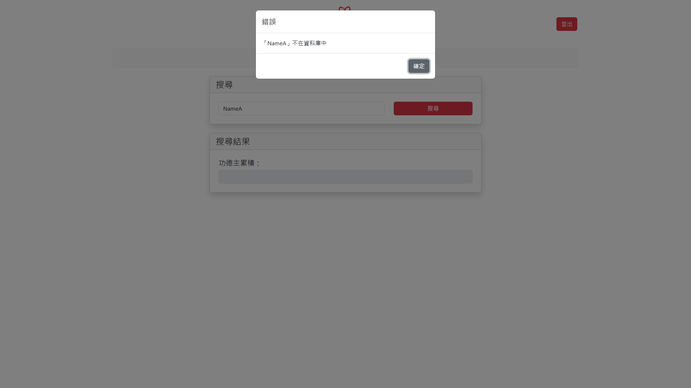

# 說明書

本系統為簡易的資料庫查詢系統，用於統計捐款資料。<br>
包含四個頁面，分別為登入、查詢、編輯關聯與上傳資料。<br>
有簡易 RWD 功能，可在不同裝置上正常顯示。

授權 token 的格式為 JWT，無有效期限。但每次操作都會檢查最後一次操作時間並更新，若超過 10 分鐘無操作則需重新登入。

## API 說明

所有 API 皆使用 json 格式傳遞資料。<br>
所有 API 皆使用 `/api` 作為前綴。

所有 API 成功時，皆會回傳以下格式：

```ts
{
  data: any,
}
```

所有 API 失敗時，皆會回傳以下格式：<br>
已處理之錯誤皆會回傳指定的 HTTP 狀態碼。<br>
若發生未處理錯誤時，將會回傳 `HTTP 500`。

```ts
{
  error: any,
}
```

<details>
<summary>/user</summary>

### POST `/user/login`

#### Request

本 API 無需授權。

```ts
{
  username: string,
  password: string,
}
```

#### Response

設定 cookie 中的 `token` 欄位，並導向 `/search` 頁面。<br>
失敗時將回傳 `HTTP 401`。

---

### GET `/user/logout`

#### Request

本 API 無需授權。

#### Response

清除 cookie 中的 `token` 欄位，並導向 `/` 頁面。

</details>

---

<details>
<summary>/donor</summary>

### DELETE `/donor`

刪除所有捐款紀錄。<br>
刪除資料庫中所有未加入關聯之捐款者資料。<br>
保留已加入關聯之捐款者資料。

#### Request

本 API 需要授權，若授權無效將回傳 `HTTP 401`。

#### Response

```ts
{
  data: {
    donors: number,
    records: number,
  }
}
```

</details>

---

<details>
<summary>/donorRecords</summary>

### GET `/donorRecords/search/:name`

#### Request

本 API 需要授權，若授權無效將回傳 `HTTP 401`。

#### Response

```ts
{
  data: number,
}
```

若資料庫中無此捐款者，將回傳 `HTTP 404`。

---

### POST `/donorRecords/upload`

#### Request

本 API 需要授權，若授權無效將回傳 `HTTP 401`。

表單中包含任意名稱欄位，檔案格式為一個或多個 Excel 檔案。<br>
Excel 檔案中必須包含以下欄位：`供養者`、`金額`。

| 欄位名稱 | 資料型態         | 說明                  |
| -------- | ---------------- | --------------------- |
| <any>    | `File \| File[]` | 一個或多個 Excel 檔案 |

#### Response

```ts
{
  data: ({
      type: "SUCCESS";
      file: string;
      count: number;
  } | {
      type: "INVALID_FILE";
      file: string;
  } | {
      type: "MISSING_HEADER";
      file: string;
      error: string[];
  } | {
      type: "INVALID_DATA";
      file: string;
      error: {
          line: number;
          missing: string[];
      }[];
  })[]
}
```

若請求中無檔案，將回傳 `HTTP 400`。

---

### GET `/donorRecords/export`

#### Request

本 API 需要授權，若授權無效將回傳 `HTTP 401`。

#### Response

下載一個統計所有捐款紀錄的 Excel 檔案。

</details>

---

<details>
<summary>/donorRelations</summary>

### GET `/donorRelations/:name`

#### Request

本 API 需要授權，若授權無效將回傳 `HTTP 401`。

#### Response

```ts
{
  data: ([string] | [string, string])[],
}
```

若資料庫中無此捐款者，將回傳 `HTTP 404`。

---

### POST `/donorRelations`

#### Request

本 API 需要授權，若授權無效將回傳 `HTTP 401`。

```ts
{
  superior: string,
  inferior: string,
}
```

#### Response

若資料庫中無此捐款者，將回傳 `HTTP 404`。

---

### DELETE `/donorRelations/:name`

#### Request

本 API 需要授權，若授權無效將回傳 `HTTP 401`。

#### Response

若資料庫中無此捐款者，將回傳 `HTTP 404`。

</details>

## 頁面說明

以下是各頁面的截圖及說明。<br>
包含所有可能的錯誤訊息。

<details>
<summary>登入頁面</summary>

使用者可以輸入帳號密碼進行登入，若帳號密碼正確，則會導向查詢頁面。<br>


若帳號密碼錯誤，則會顯示登入失敗訊息。<br>


</details>

---

<details>
<summary>查詢頁面</summary>

使用者可以輸入捐款者姓名，並查詢資料庫中的資料。<br>


查詢成功時，資料將會顯示在下方的欄位中。<br>


若資料庫中無此捐款者，則會顯示查無此人訊息。<br>


</details>

---

<details>
<summary>編輯關聯頁面</summary>

使用者可以編輯捐款者與其他捐款者的關聯，此欄位為樹狀結構。<br>


若資料庫中發現捐款者，將會在下方預覽頁顯示該捐款者關聯。<br>


若發生循環關聯，則會顯示為下列形式。<br>


若欄位名稱重複，將會顯示錯誤訊息。<br>


若資料庫中無此捐款者，則會顯示查無此人訊息。<br>


</details>

---

<details>
<summary>上傳資料頁面</summary>

使用者可以上傳捐款者的資料，資料格式為 Excel 檔案。本頁面包含資料匯出及重設資料庫功能。<br>
重設資料庫將會刪除所有捐款紀錄及未加入關聯之捐款者資料，已加入關聯之捐款者資料將會保留。<br>


上傳資料時，將會顯示訊息。<br>


重設資料庫時，將會顯示確認視窗。<br>


</details>
